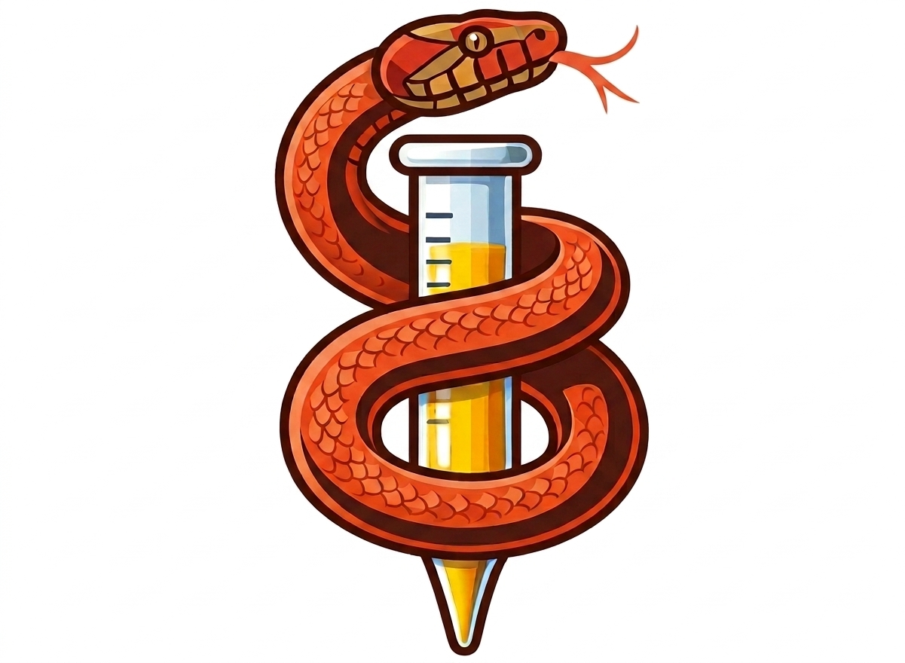

# v1b1 Skills for Claude Code

[](LICENSE)
[](https://github.com/vcjdeboer/v1b1-skills/releases)
[](https://github.com/vcjdeboer/v1b1-skills/stargazers)
[](https://github.com/vcjdeboer/v1b1-skills/commits/main)
[](https://github.com/github/spec-kit)

A trio of [Claude Code](https://claude.com/claude-code) skills for contributors writing PyLabRobot device backends against the **v1b1 capability-architecture** patterns — the architecture set out by Rick Wierenga (PyLabRobot creator) in `creating-capabilities.md` and made concrete in the merged device backends contributed by the PLR community over many PRs.

| Skill | What it does |
|---|---|
| [`v1b1-capability`](v1b1-capability/) | Reviews draft Driver / CapabilityBackend / Capability / Device code against v1b1 patterns. Produces a structured violation report with named principle, v1b1 evidence, and suggested fix per finding. **Warns; never blocks.** |
| [`v1b1-author`](v1b1-author/) | Walks you through a 5-step decision flow to scaffold a new device (driver, backend, device class, optional chatterbox). Generates a structurally-conformant Python scaffold + a markdown decision record. Calls `v1b1-capability` automatically as the final pre-emit check. |
| [`v1b1-protocol`](v1b1-protocol/) | Extracts a structured command catalog from a vendor device's communication protocol (DLL, server API, or bytestream sniff) so the catalog drops cleanly into a `v1b1-author` scaffold's command-class slot. |

The three skills cover the full v1b1 device-authoring lifecycle: extract the protocol → scaffold the device → review the result.

## Requirements

- [Claude Code](https://claude.com/claude-code) (CLI, IDE extension, or desktop app — any installation that loads `~/.claude/skills/`).
- A PyLabRobot working tree (any branch — `v1b1`, `main` post-merge, or a downstream fork) when invoking the skills against real code.

## Install

Skills live in `~/.claude/skills/`. Pick one of the install methods below; both work.

### Method A — Copy (recommended for most users)

```bash
git clone https://github.com/vcjdeboer/v1b1-skills.git
cd v1b1-skills
cp -r v1b1-capability v1b1-author v1b1-protocol ~/.claude/skills/
```

Restart Claude Code (or open a new session). The three skills become available — confirm with `/v1b1-capability`, `/v1b1-author`, `/v1b1-protocol` in the slash-command list.

### Method B — Symlink (recommended if you want to track upstream updates)

```bash
git clone https://github.com/vcjdeboer/v1b1-skills.git
cd v1b1-skills
ln -s "$(pwd)/v1b1-capability" ~/.claude/skills/v1b1-capability
ln -s "$(pwd)/v1b1-author"     ~/.claude/skills/v1b1-author
ln -s "$(pwd)/v1b1-protocol"   ~/.claude/skills/v1b1-protocol
```

`git pull` in the cloned repo now updates all three installed skills.

### Updating

- **Method A**: `git pull`, then re-run the `cp -r` step.
- **Method B**: `git pull`. Done.

### Uninstall

```bash
rm -rf ~/.claude/skills/v1b1-capability \
       ~/.claude/skills/v1b1-author \
       ~/.claude/skills/v1b1-protocol
```

(Use `rm` not `rm -rf -- ...` if Method B — `rm` removes the symlink, not the source.)

## Use

Each skill is invoked the same way as any Claude Code skill — slash command in the chat:

```
/v1b1-capability /path/to/your/driver-package/
/v1b1-author Hamilton STAR
/v1b1-protocol /path/to/vendor-protocol-dump
```

`v1b1-capability` also surfaces an **auto-detect offer** when Claude reads or edits Python code that imports `pylabrobot`, defines a `Driver`/`Device`/`Capability`/`CapabilityBackend` subclass, or matches Rick's naming conventions — Claude prompts:

> Want me to run the v1b1 review on this draft?

Reply "yes" to run; "no" debounces for the session.

For full per-skill instructions and input forms, see each bundle's `README.md`:

- [`v1b1-capability/README.md`](v1b1-capability/README.md)
- [`v1b1-author/README.md`](v1b1-author/README.md)
- [`v1b1-protocol/README.md`](v1b1-protocol/README.md)

## What the skills enforce

The patterns are extracted from two sources:

1. Rick Wierenga's **`creating-capabilities.md`** prose (vendored at `v1b1-capability/creating-capabilities.md`), which sets out the v1b1 architecture and naming conventions.
2. v1b1-merged device code in upstream PyLabRobot — xArm6, BioShake, Nimbus, STAR, Tecan Infinite, Opentrons OT2 (capability-migration branch) — contributed and refined by the PLR community across many PRs. The merged code is what makes each pattern concrete and verifiable.

Each pattern carries a v1b1 evidence reference (file path, class name, commit hash) that traces back to either Rick's prose, community-contributed device code, or both. See [`v1b1-capability/reference.md`](v1b1-capability/reference.md) for the full pattern table and audit trail.

The skills are **downstream of Rick's prose and the community's code**. They do not propose changes to v1b1; they enforce what's already there. New patterns are added only with v1b1 evidence (file path, class name, commit hash) following the audit procedure in [`v1b1-capability/audit.md`](v1b1-capability/audit.md).

## Versioning

Releases are tagged on this repo: `v<major>.<minor>.<patch>`. Each release ships all three skills together (their audit cadence is shared). The current per-skill versions are recorded in each skill's frontmatter:

- `v1b1-capability/reference.md` — `skill_version: 1.0`
- `v1b1-author/SKILL.md` — `skill_version: 0.9-RC`
- `v1b1-protocol/SKILL.md` — `skill_version: 0.9-RC`

See [`CHANGELOG.md`](CHANGELOG.md) for release notes.

## Contributing

Pattern proposals and skill improvements welcome. Before opening a PR:

1. Find (or write) the v1b1 device that demonstrates the pattern. The skill enforces only patterns with v1b1 evidence — no speculative additions.
2. Author the pattern entry following the contract in [`v1b1-capability/reference.md`](v1b1-capability/reference.md).
3. Pair with an anti-pattern fixture under `v1b1-capability/tests/anti-patterns/` if the pattern has a clean signature.
4. Run the audit: `~/.claude/skills/v1b1-capability/audit.md`. If it passes (vendored-prose parity, citation walk, smoke + anti-pattern corpus, vocabulary leak), open the PR.

The vocabulary lockdown (`v1b1-capability/vocabulary-lockdown.md`) is **allow-list only**: any term used in skill-authored output must appear in the Emitted Terms table with a precedent in Rick's prose or v1b1 code. Adding a new term means a new row.

## License

MIT — see [`LICENSE`](LICENSE).

The bundled `creating-capabilities.md` is a vendored copy of Rick Wierenga's prose from upstream PyLabRobot ([`PyLabRobot/pylabrobot`](https://github.com/PyLabRobot/pylabrobot)), also MIT-licensed. See [`NOTICE`](NOTICE) for the attribution.

## Acknowledgements

- **Rick Wierenga** (PyLabRobot creator) for the v1b1 capability architecture and the `creating-capabilities.md` prose this skill bundle distills into a lint pass. The architectural decisions, naming conventions, and merge gating that make v1b1 a coherent thing are his.
- **The PLR community** — contributors of the BioShake, STAR, Nimbus, xArm6, Tecan Infinite, Opentrons, and other v1b1 device backends — whose merged work makes the patterns real. Every evidence citation in [`v1b1-capability/reference.md`](v1b1-capability/reference.md) traces to a file, class, or method that someone in the community wrote and Rick reviewed and merged. Without that body of code there would be nothing to extract patterns from.

This skill bundle does not author patterns; it surfaces what is already there.
